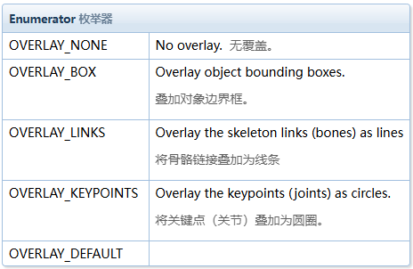
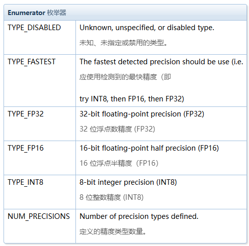

# 源码解读

[自定义代码调用 jetson_inference](https://github.com/dusty-nv/jetson-inference/blob/master/docs/imagenet-example-2.md)

[posenet 官方例子/pose_estimatiom 自定义模板](https://github.com/dusty-nv/jetson-inference/blob/master/examples/posenet/posenet.cpp)

[posenet 官方例子使用文档](https://github.com/dusty-nv/jetson-inference/blob/master/docs/posenet.md)

[posenet 库](https://github.com/dusty-nv/jetson-inference/blob/master/c/poseNet.h)

## posenet.cpp 逐行代码解读

### 非主函数

1.开源代码版权声明

```cpp
/*
*版权所有 (c) 2020，NVIDIA CORPORATION。版权所有。
*
*特此免费向任何获得许可的人授予许可
*本软件和相关文档文件的副本（“软件”），
*不受限制地处理本软件，包括但不限于
*使用、复制、修改、合并、发布、分发、再许可的权利，
*和/或出售本软件的副本，并允许接受该软件的人
*提供软件可实现此目的，但需满足以下条件：
*
*上述版权声明及本许可声明均包含在
*软件的所有副本或主要部分。
*
*本软件按“原样”提供，不提供任何形式的明示或保证
*默示的，包括但不限于适销性保证，
*适用于特定目的且不侵权。 在任何情况下都不得
*作者或版权所有者对任何索赔、损害或其他责任负责
*责任，无论是合同行为、侵权行为还是其他行为
*来自、脱离或与软件或使用或其他相关
*软件交易。
*/
```

2. 头文件引入
   `#include "videoSource.h"`:包含了视频捕获的接口，位于 jetson-untils 内。[见接口调用](https://rawgit.com/dusty-nv/jetson-inference/master/docs/html/videoSource_8h.html)。
   `#include "videoOutput.h"`:包含了视频输出的接口，位于 jetson-untils 内。[见接口调用](https://rawgit.com/dusty-nv/jetson-inference/master/docs/html/videoOutput_8h.html)。
   `#include "poseNet.cpp"`:包含了 posenet 姿态估计的接口，位于 jetson-inference 内。[见接口调用](https://rawgit.com/dusty-nv/jetson-inference/master/docs/html/poseNet_8h.html)。
   `#include <signal.h>`:c 标准库，用于系统处理信号，如终止指令 `ctrl+c`。[见接口调用](https://runoob.com/cprogramming/c-standard-library-signal-h.html)。
3. 使用 signal 函数来捕捉 SIGINT 信号（通常由 Ctrl+C 产生）

```cpp
// 全局变量
bool signal_recieved = false; // 标记是否接收到中断信号

// 信号处理函数
void sig_handler(int signo)
{
	if( signo == SIGINT ) // 如果接收到 SIGINT 信号
	{
		LogVerbose("received SIGINT\n"); // 输出日志信息
		signal_recieved = true; // 设置标记为真
	}
}
```

`LogVerbose()`记录详细日志，[详见说明](https://rawgit.com/dusty-nv/jetson-inference/master/docs/html/group__log.html#ga98544477d87d57d0b8e2b3ac03481785)。

4. 打印使用说明

```cpp
int usage()
{
    printf("usage: posenet [--help] [--network=NETWORK] ...\n");
    printf("                input_URI [output_URI]\n\n");
    printf("Run pose estimation DNN on a video/image stream.\n");
    printf("See below for additional arguments that may not be shown above.\n\n");
    printf("positional arguments:\n");
    printf("    input_URI       resource URI of input stream  (see videoSource below)\n");
    printf("    output_URI      resource URI of output stream (see videoOutput below)\n\n");

    printf("%s", poseNet::Usage());  // 打印 poseNet 的使用说明
    printf("%s", videoSource::Usage());  // 打印 videoSource 的使用说明
    printf("%s", videoOutput::Usage());  // 打印 videoOutput 的使用说明
    printf("%s", Log::Usage());  // 打印日志模块的使用说明

    return 0;
}
```

### 主函数

#### 解析指令与初始化

1. 解析创建 main 时的指令：./${源码文件名} {指令 1} {指令 2} ...

```cpp
commandLine cmdLine(argc, argv);// 创建commandLine类

if( cmdLine.GetFlag("help") )// 检查命令行中是否含help
{
	return usage();
}
```

commandLine 命令行解析类，[详见说明](https://rawgit.com/dusty-nv/jetson-inference/master/docs/html/group__commandLine.html#a3e9685cf096fe039982b2749b2fd37b7)。

2. 将 sig_handler()和 SIGINT 中断信号注册为信号处理函数

```cpp
if( signal(SIGINT, sig_handler) == SIG_ERR )
{
	LogError("can't catch SIGINT\n");
}
```

3. 创建视频输入流与输出流

```cpp
// 输入
videoSource* input = videoSource::Create(cmdLine, ARG_POSITION(0));
if( !input )
{
	LogError("posenet: failed to create input stream\n");
	return 1;
}
// 输出
videoOutput* output = videoOutput::Create(cmdLine, ARG_POSITION(1));
if( !output )
{
	LogError("posenet: failed to create output stream\n");  
	return 1;
}
```

`ARG_POSITION(*)`是指命令行指令索引，\*为索引，该索引指向 cmdLine 前两位，都为 URL，[URL 的格式查看](https://rawgit.com/dusty-nv/jetson-inference/master/docs/html/group__video.html#structURI)。 4.创建姿态估计网络

```cpp
poseNet* net = poseNet::Create(cmdLine);

if( !net )
{
	LogError("posenet: failed to initialize poseNet\n");
	return 1;
}
```

5. 解析叠加标志

```cpp
const uint32_t overlayFlags = poseNet::OverlayFlagsFromStr(cmdLine.GetString("overlay","links,keypoints"));
```

cmdLine.GetString(“命令字符串”，“命令值字符串”，...)[用法见](https://rawgit.com/dusty-nv/jetson-inference/master/docs/html/group__commandLine.html#a79b0fc5258dbd12ba4b0cb5df77d424c),匹配上返回“命令值字符串”指针，反之则返回 NULL。
poseNet::OverlayFlagsFromStr()[用法见](https://rawgit.com/dusty-nv/jetson-inference/master/docs/html/group__poseNet.html#a1bebbf414fd20210c469223433bb604a)，将字符串序列转换为 OverlayFlags 枚举。
该代码完成输出视频的处理相关设置: 有关键点并连接。



#### 主循环

当接收到中断指令（crtl+c）时结束，反之继续。

```cpp
while( !signal_recieved )
{
	...
}
```

1. 捕获当前帧

```cpp
uchar3* image = NULL;
int status = 0;
if( !input->Capture(&image, &status) )
{
	if( status == videoSource::TIMEOUT )
    {
        continue;
    }
     break;
}
```

input->Capture()，[用法见](https://rawgit.com/dusty-nv/jetson-inference/master/docs/html/group__video.html#a36a40e4d196aaf31540076317d49aaf6)
该代码完成捕获视频帧图像捕获，仅在超时和正常时正常捕获，其余情况跳过捕获。

2. 运行姿态估计

```cpp
std::vector<poseNet::ObjectPose> poses;
if( !net->Process(image, input->GetWidth(), input->GetHeight(), poses, overlayFlags) )
{
	LogError("posenet: failed to process frame\n");
	continue;
}

LogInfo("posenet: detected %zu %s(s)\n", poses.size(), net->GetCategory());
```

创建[poseNet::ObjectPose](https://rawgit.com/dusty-nv/jetson-inference/master/docs/html/structposeNet_1_1ObjectPose.html)的容器 pose 用于记录处理结果，net->Process()[用法见](https://rawgit.com/dusty-nv/jetson-inference/master/docs/html/group__poseNet.html#ac429431dc3b83dcd5a5f3fcffe446047)对给定图像执行姿势估计，返回物体姿势并叠加结果与 pose 中，函数成功时返回 true，反之为 false。

LogInfo()完成处理过程中相关数据的打印输出，poses.size()输出容器中对象数量(关于 vector[基本用法](https://www.runoob.com/cplusplus/cpp-vector.html)，[实例](https://www.runoob.com/w3cnote/cpp-vector-container-analysis.html))，此处可代表人数;net->GetCategory()获取检测到的物体类别（例如人体、手）。

3. 渲染输出

```cpp
if( output != NULL )
{
	output->Render(image, input->GetWidth(), input->GetHeight());
	char str[256];
	sprintf(str, "TensorRT %i.%i.%i | %s | Network %.0f FPS", NV_TENSORRT_MAJOR, NV_TENSORRT_MINOR, NV_TENSORRT_PATCH, precisionTypeToStr(net->GetPrecision()), net->GetNetworkFPS());
output->SetStatus(str);
// 检查用户是否关闭输出窗口
	if( !output->IsStreaming() )
		break;
}
// 打印时间信息
net->PrintProfilerTimes();
```

NV_TENSORRT_MAJOR, NV_TENSORRT_MINOR, NV_TENSORRT_PATCH 等宏输出 TensorRT 的相关性信息。
net->GetPrecision()返回当前使用的网络精度，net->GetNetworkFPS()返回当前使用的网络帧率。



4. 释放内存

```cpp
LogVerbose("posenet: shutting down...\n");

SAFE_DELETE(input);
SAFE_DELETE(output);
SAFE_DELETE(net);

LogVerbose("posenet: shutdown complete.\n");

return 0;
```

## 构建自定义代码调用 jetson-inference

### 自定义 posenet 例子

在模板的基础上添加导出关键点至 csv

1. 头文件更改

```cpp
#include <jetson-utils/videoSource.h>
#include <jetson-utils/videoOutput.h>
#include <jetson-inference/poseNet.h>

#include <signal.h>

#include <fstream> // 添加头文件以处理文件操作
```

调用 jetson-inference 是最好指定各库所处位置，然后添加 `<fstream>`文件流用于写入文件。

2. 初始化段添加创建输出文件

```cpp
 std::ofstream keypointsFile("keypoints.csv");// 打开一个文件用于保存关键点

 keypointsFile << "@video_source: " << "@width: " << input->GetWidth() << " @height: " << input->GetHeight() << "\n"; // 写入视频源的宽度和高度

keypointsFile << "frame,person_id,keypoint_id,x,y\n";// 写入CSV文件头

size_t frame = 0; // 定义帧编号
```

3. 主循环段添加写入数据

```cpp
for (const auto &pose : poses)
{
	for (const auto &keypoint : pose.Keypoints)
	{
		keypointsFile << frame << "," << pose.ID << "," << keypoint.ID << "," << keypoint.x << "," << keypoint.y << "\n";
	}
}
frame++; // 增加帧编号
```

> tips:下列演示 c++容器遍历元素的方法

```cpp
// 使用传统的for循环（适用于索引访问的容器，如std::vector）：
std::vector<int> vec = {1, 2, 3, 4, 5};
for (size_t i = 0; i < vec.size(); ++i) {
    std::cout << vec[i] << std::endl;
}

// 使用范围`for`循环（适用于所有支持范围for的容器，如std::vector, std::list等）：
std::vector<int> vec = {1, 2, 3, 4, 5};
for (const auto &value : vec) {
    std::cout << value << std::endl;
}

// 使用迭代器（适用于所有STL容器，如std::vector, std::map等）：

std::vector<int> vec = {1, 2, 3, 4, 5};
for (auto it = vec.begin(); it != vec.end(); ++it) {
    std::cout << *it << std::endl;
}
```

4. 释放内存

```cpp
keypointsFile.close(); // 关闭文件
```

### 编译自定义代码

编写 CMakeLists.txt

```txt
# cmake最低要求版本（视自定义项目更改）
cmake_minimum_required(VERSION 2.8)

# 项目名字（视自定义项目更改）
project(posent)

# 导入 jetson-inference 和 jetson-utils 包.（不应更改）
find_package(jetson-utils)
find_package(jetson-inference)


# CUDA 包是必要的（不应更改）
find_package(CUDA)

# build时出现error：cannot find -lvpi添加VPI
# build时出现error：cannot find -lxxx添加xxx包（视自定义项目更改）
find_package(VPI 2.0)

# 添加libnvbuf-utils的位置，便于项目链接（不应更改）
link_directories(/usr/lib/aarch64-linux-gnu/tegra)

# 生成可执行文件（视自定义项目更改）
cuda_add_executable(posenet posenet.cpp)

# 将本项目与jestson-inference链接（不应更改）
target_link_libraries(posenet jetson-inference)
```

然后 `cmake`生成 makefile，`make`执行 makefile 完成代码编译生成。
